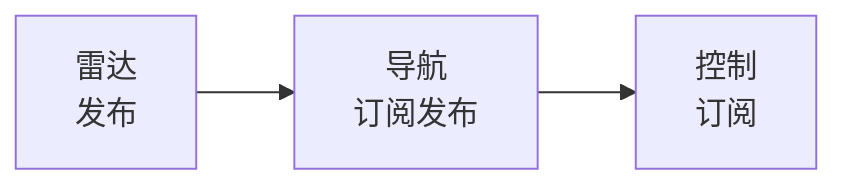
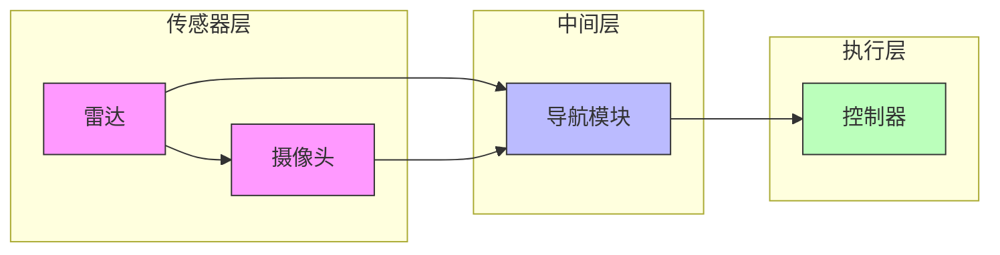
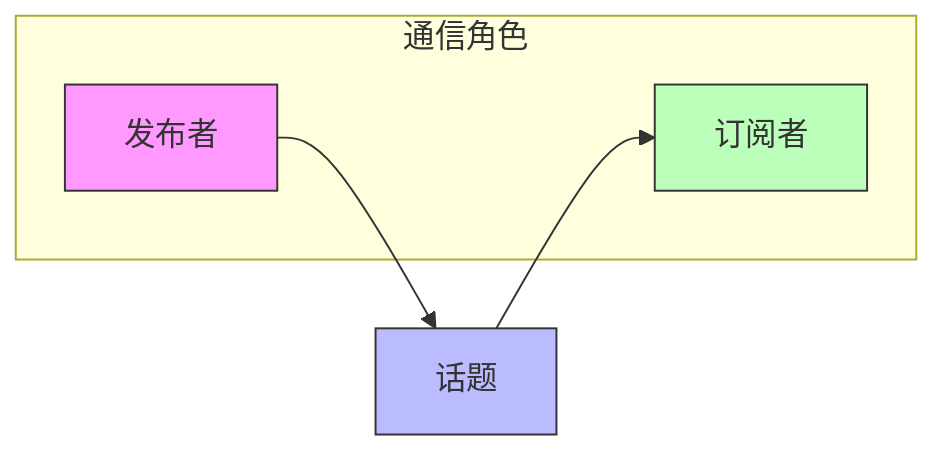

# 第二章 ROS通信机制

|通信策略|备注|
|:---|:---|
|话题通信 | 发布订阅|    
|服务通信 |请求响应|
|参数服务器| 参数共享|

## 话题通信 理论模型

> 话题通信是基于 ```发布订阅模式``` 


```mermaid

graph LR
    ld[雷达<br>发布]-->dh[导航<br>订阅发布]
    dh-->kz[控制<br>订阅]

```


```mermaid
graph LR
    subgraph "传感器层"
        ld[雷达] --> cam[摄像头]
    end
    subgraph "中间层"
        dh[导航模块]
    end
    subgraph "执行层"
        kz[控制器]
    end

    ld --> dh
    cam --> dh
    dh --> kz

    classDef sensor fill:#f9f,stroke:#333
    classDef middleware fill:#bbf,stroke:#333
    classDef actuator fill:#bfb,stroke:#333

    class ld,cam sensor
    class dh middleware
    class kz actuator
```


```mermaid
graph LR
    subgraph "通信角色"
        fb[发布者]
        sc[订阅者]
    end
    topic[话题]

    fb --> topic
    topic --> sc

    style fb fill:#f9f,stroke:#333
    style topic fill:#bbf,stroke:#333
    style sc fill:#bfb,stroke:#333
```

