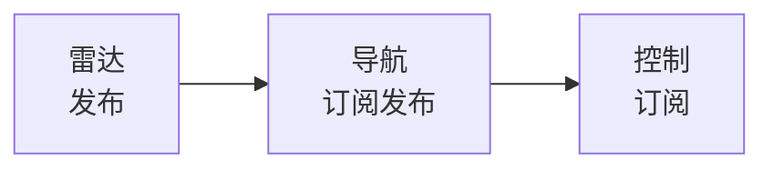
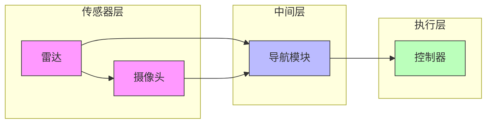
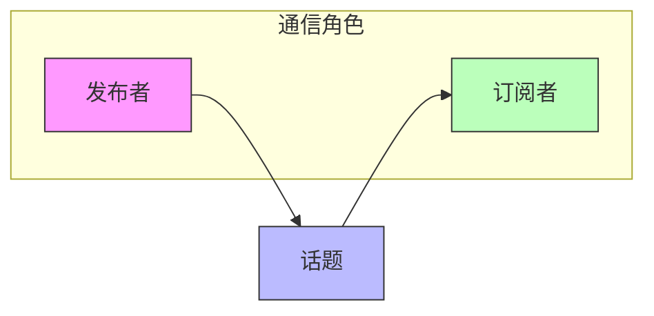
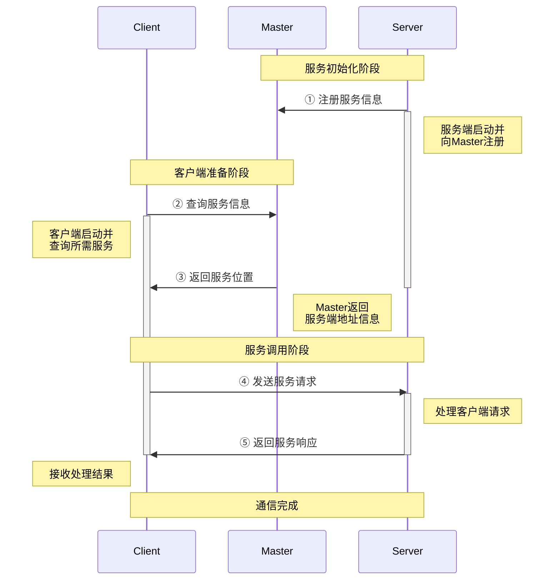

# 第二章 ROS通信机制

|通信策略|备注|
|:---|:---|
|话题通信 | 发布订阅|    
|服务通信 |请求响应|
|参数服务器| 参数共享|

## 话题通信 理论模型

> 话题通信是基于 ```发布订阅模式``` 







## 服务通信 理论模型

> 服务通信是基于 ```请求-响应模式```

### 基本概念

- **服务端 (Server)**: 提供服务的一方，等待客户端的请求
- **客户端 (Client)**: 请求服务的一方，向服务端发送请求
- **管理者（master）** : ROS系统管理器，管理所有节点
- **服务 (Service)**: 定义了请求和响应的数据结构

### 工作流程


* 注意
    * 保证顺序，客户端发起请求时候，服务端需要已经启动
    * 客户端和服务端都可以存在多个

> src = 请求 + 相应

> 命令行调用进行测试服务的回调函数

```c
rosservice call addInts "num1: 1
num2: 5"
```


